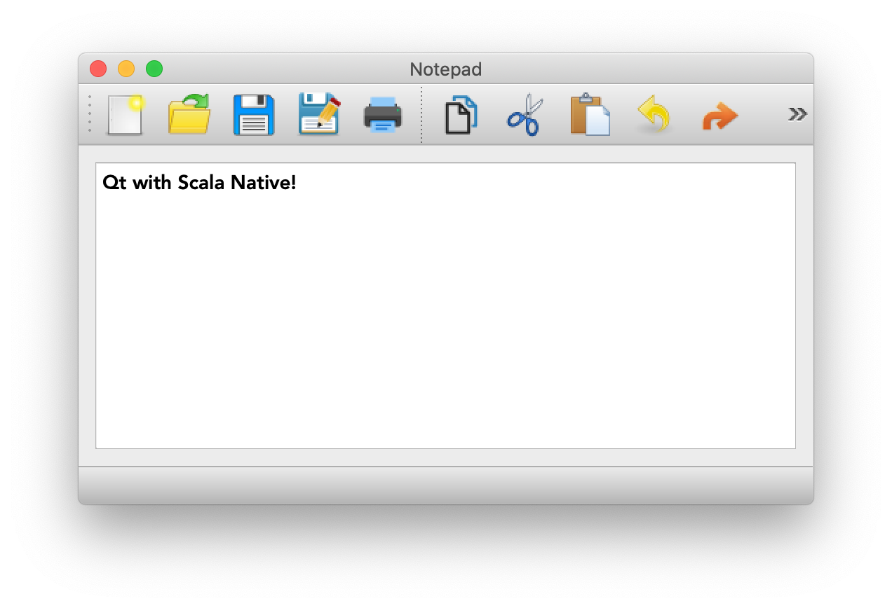

===============
scalanative-qt5
===============

Experimental `Scala Native <https://www.scala-native.org>`_ bindings for `Qt <https://www.qt.io>`_.

**WARNING**: This project is still highly experimental! The API may change at any time without further notice!

Dependencies
------------
SN-Qt uses `swog <https://github.com/jokade/swog>`_ to generate the required `C++` wrappers on the fly from Scala classes.
These wrappers must then be compiled and linked into the executable. For this to work you currently need to publish the following dependencies locally:

* SN-0.4.0-SNAPSHOT with `this PR <https://github.com/scala-native/scala-native/pull/1632>`_
* sbt-nbh master `<https://github.com/jokade/sbt-nbh>`_

Demo
----

To run this demo, first `publishLocal` the required Dependencies_.
Then you should be able to run the demo with

.. code::

  sbt demo/run
